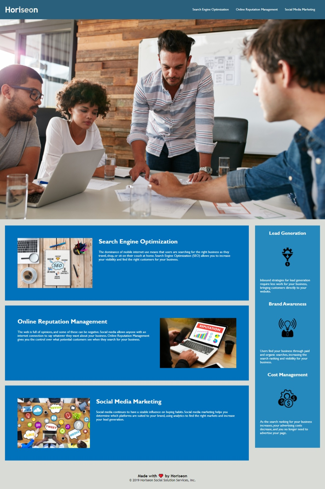

``` diff
+ marketing_agency_webpage
```

A webpage for marketing agency that follows accessibility standards and is fully optimized for search engines.

For Refactoring the existing code. following changes have been made:
```diff
!changes done in the HTML file:
```

1. title is changed to a more descriptive form.
2. fixed issue with the links in the header so that they all work properly.
3. most of the divs have been replaced by semantic HTML tags.
4. aria-label has been used to give a semantic meaning to the background image.
5. alt attribute has been used in all the image tags to give them a semantic meaning.
6. headings are put in the sequential order.

``` diff
!changes done to the css file
```

1. the class names are changed in accordance with the changes in the class names in html file.
2. the selectors and properties are consolidated.
3. comments have been added for each section.

``` diff
+URL of the deployed application:```
 https://rajnidua.github.io/marketing_agency_webpage/




